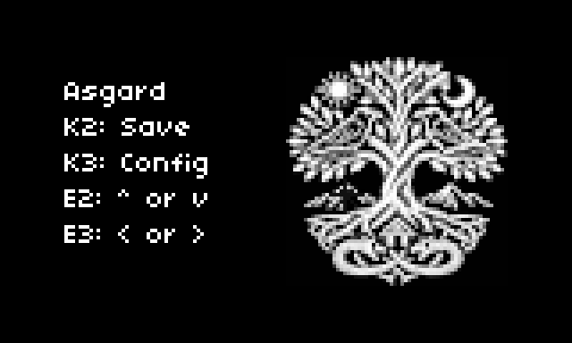

# Ygg Drone Synthesizer Engine

A Lyra-8 inspired drone synthesizer for SuperCollider and Norns, designed for MPE controllers and evolving spectral harmonies.



[Jörmungandr](https://soundcloud.com/shawn-garbett/jormungandr) Demo seed: 42, B locrian, 10s. 

[Discussion](https://llllllll.co/t/ygg-organismic-norns/74051) 

## Overview

`;install https://github.com/spgarbet/Ygg`

Ygg is an 8-voice polyphonic drone synthesizer with:
- **Voice stealing** from oldest voice (ring buffer allocation), with hold after release.
- **MPE support** (pitch bend and pressure per note)
- **Cross-modulation matrix** with 4 routing modes and local voice overrides.
- **Harmonics morphing** (sine → square → saw)
- **Leslie-style vibrato** for stereo expansion
- **Hold mode** for sustained drones
- **2-tap modulated delay**
- **Tube-style distortion** _It goes to 11!_
- **Global LFO** with 4 modes

## Architecture

### Screens

On the main screen you will see the Yggdrasil and it has 8 points that can be navigated on the tree that are patches. K2 normally navigates pages left and K3 forward. The E2 and E3 encoders navigate the tree of patches. 

The screens to the right are configuration screens. E2 changes the selection of the parameter and E3 changes it's value. 

The final screen to the right is the demo, and K3 here starts and stops the demoo. 

The screen to the left of the main Ygg screen is the MPE settings. These are global and not saved per patch but affect all patches. Hitting K2 again on this screen saves the state of everything. 

### Signal Flow

```
8 Voices (to individual buses) → Voice Mixer (sum to stereo) → Delay → Distortion → Main Out
                                      ↓
                                 Cross-Modulation (feedback)
                                      ↑          ↑        
                                  Global LFO  Main Out
```

### Voice Parameters (per voice)

- `freq` - Base frequency in Hz
- `amp` - Amplitude (0-1)
- `attack` - Attack time in seconds
- `release` - Release time in seconds
- `hold` - Hold depth (0-1)
- `vibrato_freq` - Vibrato rate in Hz (0 = mono, >0 = stereo)
- `vibrato_depth` - Depth of Vibrato(0, 1)
- `harmonics` - Waveform morph (0=sine, 0.5=square, 1.0=saw)
- `pitch_bend` - MPE pitch bend in semitones
- `pressure` - MPE pressure (0-1, scales amplitude)
- `voice_mod_source` - Modulation source
  - **Cross Modulation Voice**: 1
  - **LFO**: 2
  - **Pre Delay**: 3
  - **Line Out**: 4

### Global Parameters

#### Cross-Modulation 

- `attack` (0-20) Attack time
- `release` (0-20) Release time
- `hold` (0-1) Hold level (a note going over this amp can't fall below it)
- `vibrato_depth` (0-0.1) 
- `mod_depth` (0-1)
- `routing`
  - **Self (1)**: 1 ↔ 2, 3 ↔ 4, 5 ↔ 6, 7 ↔ 8, 
  - **Neighbor (2)**: 1-2 ↔ 3-4, 5-6 ↔ 7-8  
  - **Cross (3)**: 1-2 ↔ 5-6, 3-4 ↔ 7-8  
  - **Loop (4)**: 1-2 → 3-4 → 5-6 → 7-8 → 1-2

### LFO Modes

- `lfo_freq_a`
- `lfo_freq_b`
- `lfo_style`
  - **Single (1)**: Use freqA only
  - **Sum (2)**: freqA + freqB
  - **Product (3)**: freqA × freqB
  - **Slewed (4)**: Soft slewing
  - **FM (5)**: Frequency modulation

### Delay Parameters

- `delay_time_1`, `ygg_delay_time_2` - Delay taps times (0-2 seconds)
- `delay_mod_1`, `ygg_delay_mod_2` - Two taps modulation depth
- `delay_fb` - Feedback amount (0-1)
- `delay_mix` - Dry/wet mix (0-1)
- `delay_mod_type` - 1: Normal, 2: Gated (Square Wave) LFO

### Distortion Parameters

- `dist_drive` - Drive amount (1-11)
- `dist_mix` - Dry/wet mix (0-1)

### Voice Parameters

- `vib_n` - Vibrato frequency (0-20)
- `mod_src_n` -
  - **Voice (1)**: Use cross modulation voice
  - **LFO (2)**: Use LFO output
  - **pre Delay (3)**: Use pre delay output  
  - **Line Out (4)**: Use final line out

## AI Disclosure

Claude.ai was used in the construction of this. However, the design was cleanroomed and completely human generated. Claude generated framework code, but did not assist in the formulation of ideas or design.
